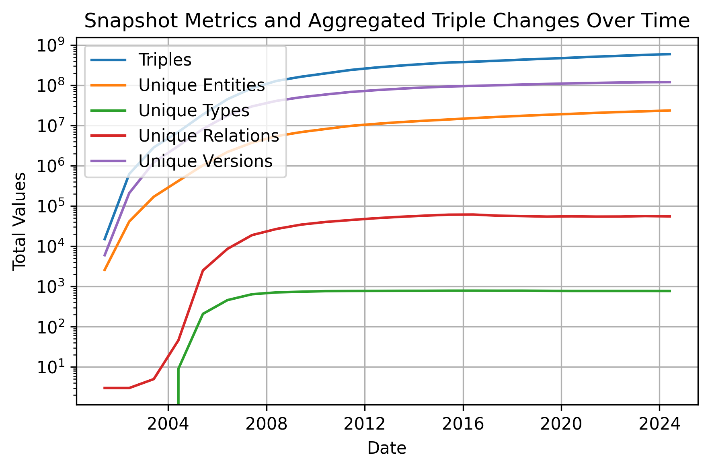
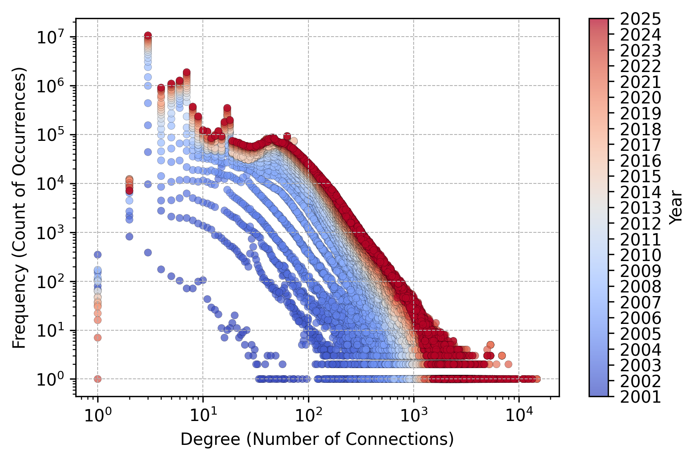

# DBpedia Temporal Graph Extraction

The DBpedia Temporal Knowledge Graph (DBpedia-TKG) is an extension of the DBpedia framework that incorporates temporal dynamics, capturing the evolution of knowledge from Wikipedia over time. It provides a rich temporal dataset with over 1.7 billion triples and 270 million distinct start and end times for their lifespans, derived from Wikipedia's meta-history dumps. This repository includes detailed configurations, such as temporal filters and DBpedia ontology versions, enabling flexible extractions tailored to specific use cases. With its temporal annotations, DBpedia-TKG supports advanced applications in temporal reasoning, predictive modeling, and performance benchmarking. It is a valuable resource for researchers and developers interested in dynamic knowledge representation and temporal graph analytics. The dataset is openly available under the CC BY-SA 4.0 license.

# Repository Structure

- **[deploy](deploy/)**  contains the relvant files to deploy the DIEF servers and the SPARK cluster to Docker Swarm.
- **[execute](execute)** contains relevant scripts to execute and evaluate DBpedia Temporal construction.
- **[eval](eval)** contains python code to plot the results from the eval process 
- **[examples](examples)** contains query examples on extracted DBpedia-TKG data
- **[generation.md](generation.md)**  short documentation to execute a simple extraction
- **[ODIBEL]()** framework that currently contains the Scala SPARK code for construction and evaluation of the DBpedia temporal graph (will be migrated soon!)

# Datasets 

> The zenodo repository contains further statisitcs on the TKG.

| Name | Varian | Version | DOI | Other Links |
| --- | --- | --- | --- | ---|
| DBpedia-TKG | FULL | 2024-06-01 | [10.5281/zenodo.14532571](https://doi.org/10.5281/zenodo.14532571) | [Other Formats \& Supplements](https://cloud.scadsai.uni-leipzig.de/index.php/s/QeyqwaWSqPgpHdq) |


<p float="left">
  
   
</p>


# Data Model

**CSV Snippet**

```csv
head,       rel,                tail,                   tStart,      tEnd,     rStart, rEnd
dbo:Leipzig,dbo:populationTotal,"510043"^<xsd:integer>, 2019-08-13, 2019-10-28, 389,   647
dbo:Leipzig,dbo:populationTotal,"605407"^<xsd:integer>, 2019-10-28, 2021-04-11, 647,   250
...
```

**NQuads Snippet**

```turtle
<dbr/Leipzig> <dbo/populationTotal> "510043" <tkg/..389-..647> .
<tkg/..389-..647> <tkg/start> "2019-08-13 12:02:50"^^xsd:dateTime <tkg> .
<tkg/..389-..647> <tkg/end>   "2019-10-28 19:35:51"^^xsd:dateTime <tkg> .

<dbr/Leipzig> <dbo/populationTotal> "605407" <tkg/..647-..250> .
<tkg/..647-..250> <tkg/start> "2019-10-28 19:35:51"^^xsd:dateTime <tkg> .
<tkg/..647-..250>  <tkg/end>  "2021-04-11 18:51:06"^^xsd:dateTime <tkg> .
```

# Generation Guidelines

see generation.md

# Brief Benchmark

see eval/benchmark.md

# Development 

Development notes.

## Pull Submodule

```
git submodule update --init --recursive
```

# Citing

```
@inproceedings{DBLP:conf/esws/HoferTRR25,
  author       = {Marvin Hofer and
                  Maximilian Mario T{\"{o}}pfer and
                  Christopher Rost and
                  Erhard Rahm},
  editor       = {Edward Curry and
                  Maribel Acosta and
                  Mar{\'{\i}}a Poveda{-}Villal{\'{o}}n and
                  Marieke van Erp and
                  Adegboyega K. Ojo and
                  Katja Hose and
                  Cogan Shimizu and
                  Pasquale Lisena},
  title        = {DBpedia-TKG: Capturing Wikipedia's Evolution as Temporal Knowledge
                  Graphs},
  booktitle    = {The Semantic Web - 22nd European Semantic Web Conference, {ESWC} 2025,
                  Portoroz, Slovenia, June 1-5, 2025, Proceedings, Part {II}},
  series       = {Lecture Notes in Computer Science},
  volume       = {15719},
  pages        = {262--279},
  publisher    = {Springer},
  year         = {2025},
  url          = {https://doi.org/10.1007/978-3-031-94578-6\_15},
  doi          = {10.1007/978-3-031-94578-6\_15},
  timestamp    = {Tue, 10 Jun 2025 17:38:39 +0200},
  biburl       = {https://dblp.org/rec/conf/esws/HoferTRR25.bib},
  bibsource    = {dblp computer science bibliography, https://dblp.org}
}
```

# Licence

The Generator is `GPLv3` and the Dataset is `CC-BY-SA 4.0.`
