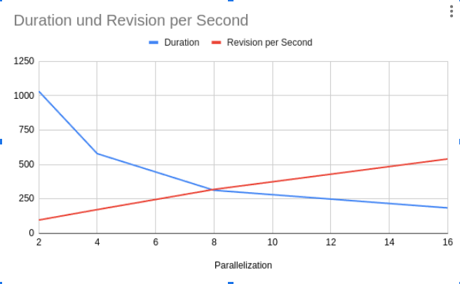

# Resource and Performance Benchmark Statistics

To evaluate performance, we created a minidump from a larger MediaWiki dataset consisting of over 850 files. This minidump contains 50 files, each with a maximum of 10,000 revisions, totaling 500,000 revisions for benchmarking.
It is available at our [Other Formats \& Supplements](https://cloud.scadsai.uni-leipzig.de/index.php/s/QeyqwaWSqPgpHdq) location.

**Test Environment**
* Hardware: Ryzen 9950HX (16c/32t), 32GB RAM, 1TB SSD
* Parallelization: Number of concurrent Dief web servers used by Spark job workers

**Benchmark Results**

|Parallelization|Duration|Revision per Second|
|:----|:----|:----|
|2|1032|96,89922481|
|4|579|172,7115717|
|8|313|319,4888179|
|16|185|540,5405405|

The memroy consumption is about 500mb per worker and between 2-4GB per DIEF service.